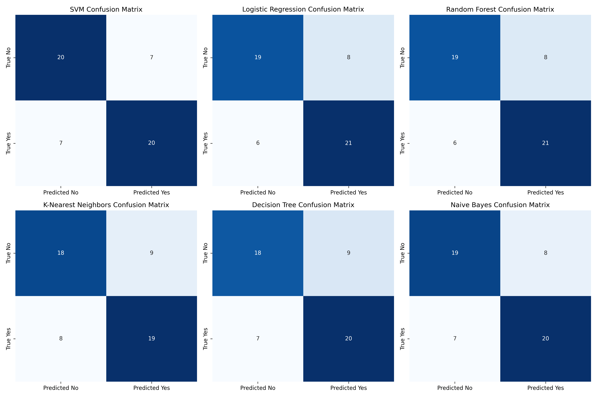

# Brain Tumor Detection using GLCM Features and Machine Learning

This repository implements a machine learning pipeline for detecting brain tumors from MRI images using Gray Level Co-occurrence Matrix (GLCM) features. Various classifiers such as SVM, Logistic Regression, Random Forest, K-Nearest Neighbors, Decision Tree, and Naive Bayes are evaluated on this dataset.

## Requirements

Ensure you have the following Python libraries installed:

- OpenCV
- NumPy
- Pandas
- Scikit-Image
- Scikit-Learn

You can install them using pip:

```bash
pip install opencv-python numpy pandas scikit-image scikit-learn
```

## Dataset

The dataset used in this project is the **Brain MRI Images for Brain Tumor Detection** dataset, which can be downloaded from Kaggle:

- [Brain MRI Images for Brain Tumor Detection](https://www.kaggle.com/datasets/navoneel/brain-mri-images-for-brain-tumor-detection/data)

The dataset contains images in two categories:
- `yes`: Brain tumor present
- `no`: Brain tumor absent

## Code Overview

### 1. GLCM Feature Extraction

The `extract_glcm_features` function computes the following GLCM-based features from grayscale images:

- **Contrast**: Measures the intensity contrast between a pixel and its neighbor.
- **Homogeneity**: Measures the closeness of the distribution of elements in the GLCM.
- **Energy**: Measures the sum of squared elements in the GLCM, capturing textural uniformity.
- **Correlation**: Measures the correlation between pixel pairs in the GLCM.

The image is resized to 128x128 and normalized to 8-bit before extracting the features.

### 2. Model Training and Evaluation

Six classifiers are used to train a model for detecting brain tumors based on the extracted GLCM features:

- **Support Vector Machine (SVM)**
- **Logistic Regression**
- **Random Forest**
- **K-Nearest Neighbors (KNN)**
- **Decision Tree**
- **Naive Bayes**

The dataset is split into training and testing sets, and the models are trained and evaluated using accuracy, precision, recall, and F1-score metrics.

### 3. Results

The results from each classifier, sorted by accuracy, are displayed as follows:

| Classifier             | Accuracy | Precision | Recall  | F1-Score |
|------------------------|----------|-----------|---------|----------|
| SVM                    | 0.740741 | 0.740741  | 0.740741| 0.740741 |
| Logistic Regression     | 0.740741 | 0.740741  | 0.740741| 0.740385 |
| Naive Bayes            | 0.722222 | 0.722222  | 0.722222| 0.722127 |
| Random Forest          | 0.703704 | 0.703704  | 0.703704| 0.703297 |
| Decision Tree          | 0.703704 | 0.703704  | 0.703704| 0.703297 |
| K-Nearest Neighbors    | 0.685185 | 0.685185  | 0.685185| 0.685077 |


#### Correlation Matrix




## How to Run

1. Download the dataset from Kaggle using the following link:  
   [Brain MRI Images for Brain Tumor Detection](https://www.kaggle.com/datasets/navoneel/brain-mri-images-for-brain-tumor-detection/data)
   
2. Extract the dataset to a directory named `brain_tumor_dataset`.

3. Open and run the Jupyter Notebook `brain_tumor_detection.ipynb` to train the model and perform predictions.


